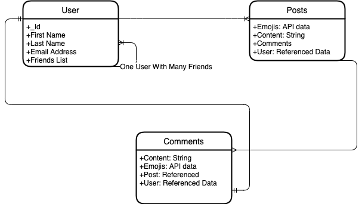

Introduction:  
The Commons is an environment for people whom traditionally reject social media.  We made a common place for users to create/edit/delete posts and do the same with comments. A fun and unique feature is the ability to add gifs to your posts and comments.
#### Userflow:
AAU: I want to connect with friends online. 
AAU: I want a simple user interface.  
AAU: I want to create posts. 
AAU: I want to be able to comment on posts. 
AAU: I want to be able to see all of my posts 
AAU: I want to be able to see all posts in my Commons Community 
#### UI/UX Research:
[Link to google form for UI/UX research](https://docs.google.com/forms/d/1O2J3TkdLbDbt9toyHhUzF9IMMAEarpFxJTk8oL4x_vk/edit?usp=sharing ) 
#### Wireframe:
    
#### ERD:
 

Technologies Used:
<ul>
<li>React</li>
<li>CSS</li> 
<li>JavaScript</li>
<li>Mongoose</li>
<li>MongoDB</li>
<li>Express</li>
<li>DotEnv</li>
<li>axios</li>
<li>bcrypt</li>
<li>cors</li>
<li>express-session</li>
<li>jsonwebtoken</li>
<li>draw.io</li>
<li>Trello</li>
<li>figma</li>
<li>body-parser</li>
<li>passport</li>
<li>google forms</li>
<li>tenor API</li>
<li>Canva</li>
</ul>

## Getting Started:  
[Link to Trello project board](https://trello.com/b/DJdsLKKn/project-3)  
[Link to The Commons App on heroku](http://project3-app-flex525.herokuapp.com/)

## Unsolved Problems: List any unsolved issues:

## Challenges:
1. Communication. 
    1. Keeping everyone on task and in the loop. (Trello helps but not prefect)
    2. Keeping communication channels open and accessible to all.(slack channel/discord)

2. Time Management:
    1. Trello assignments
    2. knowing when to say no more! It is taking too long, time to move on.
3. Organization:
    1. Better use of Trello
    2. transparency of planning
4. Google Auth
5. Tenor API

## Future Enhancements: Identify future features and enhancements planned for the project.
1. Commoners(friends section)
2. ability to view Commoners profile

# Getting Started with Create React App

This project was bootstrapped with [Create React App](https://github.com/facebook/create-react-app).

## Available Scripts

In the project directory, you can run:

### `npm start`

Runs the app in the development mode.\
Open [http://localhost:3000](http://localhost:3000) to view it in the browser.

The page will reload if you make edits.\
You will also see any lint errors in the console.

### `npm test`

Launches the test runner in the interactive watch mode.\
See the section about [running tests](https://facebook.github.io/create-react-app/docs/running-tests) for more information.

### `npm run build`

Builds the app for production to the `build` folder.\
It correctly bundles React in production mode and optimizes the build for the best performance.

The build is minified and the filenames include the hashes.\
Your app is ready to be deployed!

See the section about [deployment](https://facebook.github.io/create-react-app/docs/deployment) for more information.

### `npm run eject`

**Note: this is a one-way operation. Once you `eject`, you can’t go back!**

If you aren’t satisfied with the build tool and configuration choices, you can `eject` at any time. This command will remove the single build dependency from your project.

Instead, it will copy all the configuration files and the transitive dependencies (webpack, Babel, ESLint, etc) right into your project so you have full control over them. All of the commands except `eject` will still work, but they will point to the copied scripts so you can tweak them. At this point you’re on your own.

You don’t have to ever use `eject`. The curated feature set is suitable for small and middle deployments, and you shouldn’t feel obligated to use this feature. However we understand that this tool wouldn’t be useful if you couldn’t customize it when you are ready for it.

## Learn More

You can learn more in the [Create React App documentation](https://facebook.github.io/create-react-app/docs/getting-started).

To learn React, check out the [React documentation](https://reactjs.org/).

### Code Splitting

This section has moved here: [https://facebook.github.io/create-react-app/docs/code-splitting](https://facebook.github.io/create-react-app/docs/code-splitting)

### Analyzing the Bundle Size

This section has moved here: [https://facebook.github.io/create-react-app/docs/analyzing-the-bundle-size](https://facebook.github.io/create-react-app/docs/analyzing-the-bundle-size)

### Making a Progressive Web App

This section has moved here: [https://facebook.github.io/create-react-app/docs/making-a-progressive-web-app](https://facebook.github.io/create-react-app/docs/making-a-progressive-web-app)

### Advanced Configuration

This section has moved here: [https://facebook.github.io/create-react-app/docs/advanced-configuration](https://facebook.github.io/create-react-app/docs/advanced-configuration)

### Deployment

This section has moved here: [https://facebook.github.io/create-react-app/docs/deployment](https://facebook.github.io/create-react-app/docs/deployment)

### `npm run build` fails to minify

This section has moved here: [https://facebook.github.io/create-react-app/docs/troubleshooting#npm-run-build-fails-to-minify](https://facebook.github.io/create-react-app/docs/troubleshooting#npm-run-build-fails-to-minify)
